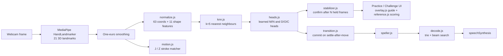

# ASL Fingerspelling Trainer

A browser-only **practice tool for the ASL fingerspelling alphabet**. Point your
webcam at your hand, and it tells you, finger by finger, how close your
handshape is to the target letter. It can also quiz you and read back what you
spell. Everything runs on your device. There is no backend and no build step,
and no video ever leaves the browser.

**Live demo:** <https://crazycatz67.github.io/asl-recognizer/>
(needs a webcam and a modern desktop or mobile browser; installable as an offline PWA)

> **What this is and isn't.** It's a fingerspelling *learning* tool: the 26
> letters, including the motion letters J and Z. It is **not ASL translation.**
> ASL is a full language with its own grammar, facial grammar and whole-word
> signs, and fingerspelling is one small part of it. See
> [Honest limits](#honest-limits).

## Features, by mode

| Mode | What you do | What it gives back |
|---|---|---|
| **Practice** | Pick a letter, or run A→Z or a 10-letter **Review** (spaced repetition) and form the shape | A live correction guide drawn on your own hand, with every joint and bone colored by its error, a "move this way" arrow at off fingertips, and a plain-language hint ("Curl your ring finger"). There's an animated demo hand (with depth cues) plus a reference photo. You hold the shape to lock it in. Includes a mastery badge and daily streak, and an optional **Test blind** mode with no hints. |
| **Challenge** | A random letter appears; form it before the timer runs out | Recognizer-gated scoring (you advance only when the classifier reads your hand as that letter), speed points, a streak, and 3 lives |
| **Spell** | Fingerspell continuously | A running transcript with a forgiving pending-word buffer, a swipe to erase, and two-hand copy/paste gestures. An optional **Fluid + speak (beta)** mode segments letters by movement rhythm, decodes them into dictionary words, and reads the sentence aloud. There's also a "practice a word" drill. |
| **Read** | No camera: watch the animated hand spell a word, then type what you saw | Receptive practice with pause/step/scrub playback, letter-by-letter near-miss feedback ("N and M are easy to mix up"), and a 5-tier **Course** that unlocks letters in teaching order |

The app also has:
- Keyboard navigation
- A high-contrast toggle
- Reduced-motion support
- A visual companion for every sound cue
- An [about page](about.html) covering privacy, limits and credits

## How it works



1. **Tracking.** MediaPipe HandLandmarker (loaded from a CDN, GPU with a CPU
   fallback) returns 21 landmarks per hand, about 30 times a second.
2. **Normalization** (`js/normalize.js`). Landmarks are wrist-centered,
   aspect-corrected and scaled to hand size, and left hands are mirrored to
   right. Eleven engineered shape features are added, for a 74-number
   vector. Training vectors and live vectors go through exactly the same
   code.
3. **Classification.** A plain-JS **k-nearest-neighbours** classifier
   (`js/knn.js`) runs over ~6.3k labelled vectors from the Kaggle
   *grassknoted/asl-alphabet* images, expanded to ~31.6k with ±15°/±30°
   rotations at load time. Three tiny learned MLP "refinement heads"
   (`js/heads.js`) are consulted only for the pairs kNN confuses (M↔N,
   D↔O↔C). On a group-aware 20% held-out split, accuracy goes from 95.9%
   (kNN alone) to **97.1%**, with every letter at 92% or better.
4. **Feedback.** `js/reference.js` scores the live vector against each
   letter's class centroid, with a per-joint tolerance learned from that
   letter's own training spread. `js/overlay.js` colors the user's own
   skeleton by that per-joint error, in a colour-blind-safer blue / orange /
   magenta with matching line styles and ✓ ~ ✕ fingertip glyphs, so colour is
   never the only signal.
5. **Words.** In Spell mode, `js/transition.js` commits a letter when the hand
   *settles after a move*, because real signing never holds still. Then
   `js/decode.js` runs a CTC-style collapse plus a beam search over a 25k-word
   trie, with emission costs weighted by the classifier's measured confusion
   matrix. This turns a noisy letter stream into words.

### Design decisions

- **Landmarks, not pixels.** The classifier only ever sees normalized joint
  coordinates, never skin or background. The same letter formed by different
  hands produces the same vector. (Detection by MediaPipe is upstream, and its
  reliability across skin tones still needs a measured evaluation; see below.)
- **kNN plus small learned heads, instead of one big model.** There's no
  training loop to ship, it's inspectable, and it's fast (~0.4 ms per
  classification). The learned heads fix only the pairs kNN gets wrong. A
  hand-written tie-breaker for those pairs was built, measured, and shelved
  when it didn't help (`js/refine.js` documents why).
- **No framework, no bundler, no dependencies beyond MediaPipe.** Plain ES
  modules that are served statically. The reusable engine is DOM-free, so the
  same modules run in the browser and under plain Node for CI.
- **Offline-first PWA.** A service worker (`sw.js`) precaches the app shell. It
  also caches the MediaPipe runtime and hand model on first use, so after one
  visit the app works offline.

### Honest limits

- **Fingerspelling, not ASL.** No whole-word signs, grammar, or facial markers.
- **Careful signing, not native speed.** Frame-by-frame classification can't read
  fast, coarticulated fingerspelling, where the information is in the
  transitions. That needs a sequence model (see
  [`docs/research-and-future.md`](docs/research-and-future.md)).
- **Fluid + speak mode is a beta.** In an offline benchmark with synthetic
  letter noise, the lexicon decoder lifts word accuracy by about 15–18 points
  over naive splitting. It's exact on clean input and ~79% at 8% letter error.
  Errors compound across a sentence, and it has not been validated live at
  real signing speed. Names and non-dictionary words won't decode.
- **Training data is posed alphabet images, mostly from one source.** Accuracy
  across multiple signers and skin tones has not been evaluated yet. That
  evaluation needs people, not code.
- **No digits (0–9) yet.**
- Known open issues are tracked in
  [`Bug Reports/checklist.md`](Bug%20Reports/checklist.md).

## Run it locally

The camera needs a secure context. `http://localhost` counts, but a `file://`
page does not.

```sh
python3 -m http.server 8000       # any static server works
# then open http://localhost:8000/
```

Windows has double-click launchers: `start-server.cmd` (localhost) and
`start-phone.cmd` (HTTPS over your LAN with a self-signed cert, for phone
testing). They use `serve.ps1` / `serve-https.ps1`, which are pure PowerShell
with no installs.

The service worker never registers on `localhost`, so dev reloads always get
fresh files.

## Test

```sh
node tools/ci-check.mjs           # dependency-free: syntax, sw.js precache list,
                                  # data well-formedness, pure-module invariants
```

Open `http://localhost:8000/tools/selftest.html` in a browser for the module
and pipeline self-test (174 checks as of 2026-09-15). Run both after every
`js/` change. `ci-check.mjs` also runs in GitHub Actions on every push and PR
(`.github/workflows/ci.yml`).

Other tools in `tools/`:

| Tool | What it does |
|---|---|
| `test-knn.html` | Accuracy and confusion matrix |
| `decode-lab.html` | Decoder bench |
| `replay-lab.html` | Full pipeline vs. recorded sequences |
| `sweep-transition.mjs` | Segmentation threshold sweep |
| `train-heads.html` | Retrain the refinement heads |
| `testHarness.js` | Drive the live app with synthetic hands (`?dev`) |

Replay numbers from `data/fs_sequences.json` are only valid *relatively*. Its
landmarks come from a different MediaPipe model (Holistic, not HandLandmarker).

**Deploy:** push to `main` → GitHub Pages. Bump `VERSION` in `sw.js` on every
deploy, or installed copies keep serving the old cached app.

## Project structure

```
index.html  about.html  manifest.webmanifest  sw.js   page shell, about page, PWA
css/style.css                                         all styling (state-driven via data-* attributes)
js/                                                   ES modules (map below)
data/     dataset.json (training vectors) · words25k.txt · confusion.json ·
          practice-words.json · curriculum.json · fs_sequences.json (Kaggle replay set)
assets/reference/   one reference photo per letter
tools/    selftest, ci-check, labs and training tools (see Test)
docs/     changelog, research notes, archived plan, code-reorg proposal
```

### Module map (`js/`)

**Engine: DOM-free, and runs under plain Node as well as the browser**

| Module | Role |
|---|---|
| `config.js` | Every tunable constant and external URL (MediaPipe version, k, thresholds, fps) |
| `normalize.js` | Landmarks → 74-dim vector; shared by dataset build and live inference |
| `dataset.js` | Loads and validates `data/dataset.json`, adds rotation augmentation |
| `knn.js` | k-nearest-neighbours classifier over a packed `Float32Array` |
| `heads.js` | Learned MLP refinement heads for M/N and D/O/C (weights in `heads.json`) |
| `refine.js` | Shelved rule-based tie-breaker, kept as a documented negative result (not wired in) |
| `stabilizer.js` | Confirms a letter only after it holds for `STABLE_FRAMES` frames |
| `onefilter.js` | One Euro adaptive landmark smoothing (low jitter when still, low lag when moving) |
| `motion.js` | J/Z motion-letter stroke matcher over a rolling fingertip path |
| `transition.js` | Rhythm-based segmentation for continuous signing (settle → move → settle) |
| `swipe.js` | Spell-mode open-hand sideways "wipe" = delete |
| `twohand.js` | Spell-mode two-hand copy (hands together) / paste (apart) |
| `speller.js` | Spell-mode transcript with a forgiving pending-word buffer |
| `decode.js` | Letter stream → words (trie + CTC collapse + beam search + confusion costs) |
| `challenge.js` | Timed "Simon says" game state (score, streak, lives) |
| `reader.js` | Read mode: word pool, answer check, near-miss diff |
| `curriculum.js` | Read-mode Course: handshape tiers, unlock gating, progress |
| `spelldrill.js` | Spell-mode "spell this word" drill |
| `posekin.js` | Demo-hand bone-length-preserving 3D bone interpolation |
| `strokekin.js` | Rigid-motion and spline math for the J/Z demo strokes and word coarticulation |

**Browser / UI: DOM, canvas, camera or audio**

| Module | Role |
|---|---|
| `main.js` | The app: camera state machine, per-frame loop, and all four modes' UI wiring |
| `camera.js` | `getUserMedia` wrapper (front/back camera, iOS quirks) |
| `mediapipe.js` | Loads the MediaPipe Tasks Vision bundle once |
| `handTracker.js` | HandLandmarker setup (GPU → CPU fallback) and per-frame `detect()` |
| `reference.js` | Per-letter scoring and hints (pure), plus the canvas demo-hand player |
| `overlay.js` | Live-camera canvas: skeleton and per-joint correction guide |
| `skeleton.js` | Shared 21-point hand rendering for the overlay and demos |
| `sheet.js` | Reusable bottom-sheet / modal controller (focus trap, inert background) |
| `tour.js` | Interactive first-run walkthrough: hand in view, which hand + mirror, palm orientation, the guide's colors live on your hand, hold to lock, first letter |
| `sound.js` | Synthesized Web Audio cues (no audio files) |
| `fx.js` | Particle burst and glow celebrations |
| `bg.js` | Reactive ambient background (canvas-2D fallback for `aurora.js`) |
| `aurora.js` | WebGL2 calm reactive background (match, hand presence/stillness), 1/4 res, <= 20 fps |
| `fxquality.js` | Effects budget: full / lite / off governor that protects detection fps |
| `fxmath.js` | Pure colour-contrast + spring helpers for the visual layer |
| `fluid.js` | Small WebGL2 stable-fluids core (half-float, sim 128 / dye <= 512) |
| `hero.js` | Landing screen: fluid stirred by pointer or fingertips, kinetic title |

## Project docs

| Doc | What's in it |
|---|---|
| [`asl-letter-recognition-plan.md`](asl-letter-recognition-plan.md) | Current status, session resume, active backlog |
| [`Bug Reports/checklist.md`](Bug%20Reports/checklist.md) | Bug tracker |
| [`docs/CHANGELOG.md`](docs/CHANGELOG.md) | Full dated history |
| [`docs/research-and-future.md`](docs/research-and-future.md) | Sentence decoding, sequence model, skin-tone evaluation plan |
| [`docs/original-plan-and-milestones.md`](docs/original-plan-and-milestones.md) | Original plan and backlog archive |
| [`docs/code-reorg-proposal.md`](docs/code-reorg-proposal.md) | Proposed `main.js` split |
| [`asl-project-roadmap.md`](asl-project-roadmap.md) | Longer-term multi-phase vision |

## Credits

- **Hand tracking:** [MediaPipe Tasks](https://ai.google.dev/edge/mediapipe) HandLandmarker (Google).
- **Training images:** the *ASL Alphabet* dataset by grassknoted (Kaggle), converted to landmark vectors.
- **Replay/stress-test sequences:** the Google *ASL Fingerspelling* Kaggle competition data.
- **Word list:** an English word-frequency list derived from Peter Norvig's n-gram data.
- **Smoothing:** the One Euro Filter (Casiez, Roussel & Vogel, 2012).
- **Inspiration:** [PopSign](https://www.popsign.org/), a Georgia Tech × RIT/NTID project.

Built as an undergraduate AI project. Feedback from Deaf and hard-of-hearing
signers is very welcome.
