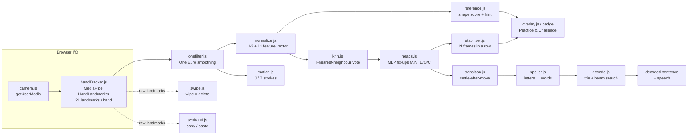

# Code guide

A map of the codebase for someone opening it for the first time. It covers
what each file does, how one camera frame moves through the code in each mode,
where the tuning knobs live, and how the code is tested.

The app is plain HTML, CSS and JavaScript ES modules. There is no framework, no
bundler and no build step. The only runtime dependency is MediaPipe, which is
loaded from a CDN. Every `js/` file starts with a header block that gives its
purpose, where it sits in the pipeline, its public API, and its units and
gotchas. Read that header first.

---

## 1. The pipeline at a glance

- **Practice and Challenge:** `camera → handTracker → onefilter → normalize → knn → heads → stabilizer → overlay`.
- **Spell (fluid):** the same path up to `heads`, then `transition → speller → decode`.
- **Spell (hold-to-type):** a second `stabilizer` instance (`spellStab`) feeds `speller.feed()` instead of `transition.js`.
- **Read:** the camera is off. `reader.js` picks a word, the demo hand in
  `reference.js` (driven by `posekin.js` and `strokekin.js`) signs it, and the
  user types what they read.

All of this is wired together in **`js/main.js`**. It holds the camera state
machine (`idle → requesting → loading → searching ↔ tracking`, plus `error`),
the per-frame `loop()`, and the UI for all four modes.

---

## 2. Every file in `js/`

### Engine (DOM-free, runs under plain Node)

These modules take plain data in and return plain data out. That lets
`tools/ci-check.mjs` and `tools/sweep-transition.mjs` run them without a
browser.

| File | Purpose |
|---|---|
| `config.js` | Every shared tunable constant and external URL: MediaPipe version and CDN URLs, `KNN_K`, `MIN_CONFIDENCE`, `STABLE_FRAMES`, the One Euro filter settings, the letter sets, and rotation augmentation. |
| `normalize.js` | Turns 21 landmarks into a translation-, scale- and aspect-invariant 63-value vector, plus 11 engineered shape features. The dataset build and live inference share this exact code. Also provides `rotateVector` and `mirrorVector`. |
| `dataset.js` | Loads and validates `data/dataset.json` and adds rotated copies of each sample at load time. |
| `knn.js` | k-nearest-neighbour classifier over a packed `Float32Array`, with partial-distance pruning. |
| `heads.js` | Small learned MLP ensembles (`js/heads.json`) that re-decide kNN's M/N and D/O/C calls. Held-out accuracy goes from 95.9% to 97.1%. |
| `refine.js` | **Shelved.** A rule-based tie-breaker for confusable pairs. It was measured and did not help, so it is kept only as a record and is not wired into the app. |
| `stabilizer.js` | Debouncing: a letter is confirmed only after `stableFrames` consecutive confident predictions. |
| `onefilter.js` | One Euro adaptive low-pass filter for landmark jitter. It smooths heavily when the hand is still and lightly when it moves. |
| `transition.js` | Spell-mode segmentation. A letter is committed when the hand settles after a move, with a majority vote over the settled window. |
| `speller.js` | Letter stream to transcript. It keeps a one-word `pending` buffer, commits a word after a pause, and records the uncorrected `raw` stream for the decoder. |
| `decode.js` | Lexicon trie plus a confusion-weighted beam search that turns a noisy letter stream into words. It falls back to a Norvig word split for unknown words. |
| `motion.js` | Detects the J and Z motion letters from the fingertip path over a ~1.6 s window. Also provides the `STROKE` templates the demo animation uses. |
| `swipe.js` | An open-hand sideways sweep means "delete" in Spell mode. |
| `twohand.js` | Two open hands brought together means "copy"; pulled apart means "paste". |
| `challenge.js` | "Simon says" speed game state: phases, lives, score, and a shrinking round timer. It reads and writes the best score through a guarded `localStorage`. |
| `curriculum.js` | Tiered lessons (`data/curriculum.json`) that unlock one tier at a time. |
| `spelldrill.js` | Spell-mode "sign this word" drill with prefix matching, score and streak. |
| `reader.js` | Read-mode quiz. It picks words, checks the typed guess, and explains a wrong answer with a letter diff and the look-alike pairs involved. |
| `posekin.js` | Bone-length-preserving 3D interpolation between two hand poses. This is what makes the demo hand's fingers swing through an arc instead of cutting straight across. |
| `strokekin.js` | Rigid-motion, spline and easing math for the demo hand's J/Z strokes, doubled-letter bounces and overshoot. |

### Browser I/O (needs a real browser)

| File | Purpose |
|---|---|
| `camera.js` | `getUserMedia` start and stop, camera count, and facing mode. Contains the iOS and first-frame quirk handling. |
| `mediapipe.js` | One cached dynamic `import()` of MediaPipe Tasks Vision, from the URL in `config.js`. |
| `handTracker.js` | Creates the HandLandmarker (GPU with a CPU fallback) and wraps `detect()` so timestamps always increase. |
| `sound.js` | Synthesized Web Audio cues: a rising "charge" tone while holding, plus success and fail sounds. There are no audio files. The mute setting is stored in `localStorage`. |

### UI and modes (DOM and canvas)

| File | Purpose |
|---|---|
| `main.js` | The app. It holds the state machine, the per-frame `loop()`, `setMode()`, and all of the Practice, Challenge, Spell and Read UI wiring. |
| `overlay.js` | The live camera overlay. `drawHands` draws a plain skeleton. `drawGuide` colours every joint by its error (blue good / orange close / magenta fix, plus solid / dashed / thick bones and ✓ ~ ✕ fingertip glyphs), labels the dashed "target" ghost and marks the worst finger with ▲. `guideStats()` reports what the last frame showed. `drawMotionGuide` draws the J/Z trace. |
| `skeleton.js` | Shared 21-point hand drawing, used by the overlay, the reference panel and the demo hand. |
| `reference.js` | Practice-mode scoring (`buildReference`: `score`, `hint`, `orient`, `regionErrors`, calibrated per letter) and the animated demo hand (`createCanonicalPlayer`). |
| `sheet.js` | A reusable controller for bottom sheets and modal dialogs, with a focus trap, inert background and Escape handling. |
| `tour.js` | The first-run walkthrough (six scenes, replayable from the "?" button). A pure scene state machine plus a DOM card; `main.js` lends it camera/Hand/Practice hooks and calls `tour.feed()` each frame. |
| `fx.js` | A celebration particle burst and a screen-edge glow. |
| `bg.js` | The ambient background. Its colour follows the match score, and each screen region reacts to that region's error. |

Other important files:

- **`index.html`** is the page, with an inline bootstrap script that registers
  the service worker except on localhost.
- **`sw.js`** is the offline service worker. Bump `VERSION` on every deploy.
- **`css/style.css`** holds the styles.
- **`data/`** holds the dataset, word lists, curriculum and confusion matrix.

---

## 3. How a frame flows through the code

`main.js` `loop()` runs on `requestAnimationFrame` and is throttled to
`TARGET_FPS`. Every mode that uses the camera starts with the same steps:

1. `tracker.detect(video, now)`. This is MediaPipe, via `handTracker.js`.
2. `smoothLandmarks()`, which calls `landmarkFilter.filter()` in `onefilter.js`
   on the first hand.
3. `motion.push(hand)` and `motion.match()` for J/Z. `swipe.push()` and
   `twohand.push()` receive the **raw** landmarks, because smoothing would
   damp the fast motion those gestures are made of.
4. `normalizeLandmarks(hand, { aspect, mirrorX, extended })` builds the feature
   vector. A left hand is mirrored so it matches the right-handed training data.
5. `classifier.classify(vec)` (kNN), then `refiner.refine(vec, label)` (heads),
   then `stabilizer.push(pred)`. In Spell mode `spellStab.push(pred)` also runs.

After that the flow depends on the mode.

### Practice (static letter)

1. `setTarget(letter)` chooses the letter. The reference panel's demo hand
   plays it through `refPlayer.setTarget(...)`.
2. Each frame, `reference.score(vec, target)` returns `{ score, bucket }`. A
   "close" shape that the classifier confidently reads as the target is
   promoted to "correct".
3. `reference.orient()` and `overlay.drawGuide(hand, reference.centroid(target), …)`
   draw the correction guide on the user's own hand.
4. `updateMeter()`, `bg.setMatch(score, bucket, reference.regionErrors())`,
   and a hint from `reference.hint()` that updates every 250 ms.
5. Hold "correct" for `HOLD_MS` (small dropouts within `HOLD_GRACE_MS` are
   forgiven). `sound.charge()` rises during the hold, then `reward()` calls
   `fx.burst`, `fx.flash`, `sound.success`, saves stats and updates the streak.

For J and Z, the only motion letters, `overlay.drawMotionGuide()` shows the
stroke to trace. `motion.metrics()` drives the progress meter, and
`stroke === target` triggers `reward()`.

### Challenge

1. `startChallenge()` calls `challenge.start(now)`. If the camera is off, it is
   started first.
2. Each frame calls
   `renderChallenge(challenge.update(now, stroke || stabilizer.current), seeing)`.
   The game advances only when the **debounced classifier** reads the target
   letter, or when a J/Z stroke is traced.
3. `challenge.js` moves through the phases study → go → play → won/miss → over.
   Each call returns an `event` that fires once and drives the sound and
   effects.

### Spell

1. The gestures come first. `swipe.match()` returns `"delete"`, which calls
   `speller.clearPending()` or `backspace()`. `twohand.match()` returns
   `"copy"` or `"paste"`, which calls `doSpellCopy()` or `speller.insert()`.
2. **Fluid mode:** `transition.push(hand, lastPred, now)` and then
   `transition.read()` return `{ letter, conf }` once per settle, which is
   passed to `speller.addLetter(letter, conf)`.
3. **Hold-to-type mode:** a wrist-speed "still" gate plus `spellStab` produce a
   `holding` flag, which is passed to `speller.feed({ holding, letter, stroke, moved, now })`.
4. When the word drill is on, `drill.match(speller.pending)` colours the
   prompt. An exact match triggers `drill.submit()` and then `nextDrillWord()`.
5. In fluid mode only, `decoder.decode(speller.raw)` runs at most every
   ~350 ms and fills the "decoded" row. After a ~2.2 s pause, `speak()` reads
   it aloud.

### Read (no camera)

1. `enterRead()` and then `nextReadWord()`. The word comes from
   `reader.next()` (free play, `data/practice-words.json`) or from
   `reader.next(course.words())` (course style, `curriculum.js`).
2. `playWord(word)` calls `readPlayer.setWord(...)` in `reference.js`'s
   canonical player. That player chains letters using `posekin.js` bone-space
   interpolation and `strokekin.js` timing. J and Z play via `setMotion`.
3. `judgeRead()` calls `reader.check(guess)`, which returns
   `{ ok, diff, confusables }`. `renderDiff()` and `renderConfusable()` show
   the result. In course style, `course.record(ok)` may unlock the next tier.

---

## 4. Where the tunable constants live

- **`js/config.js`** holds anything shared across modules or likely to be
  tuned: MediaPipe URLs and version, `NUM_HANDS`, `TARGET_FPS`,
  `LOST_HAND_FRAMES`, `OVERLAY_GRACE_FRAMES`, `ONE_EURO_*`, `KNN_K`,
  `MIN_CONFIDENCE`, `STABLE_FRAMES`, `USE_EXTENDED_FEATURES`,
  `AUGMENT_ROTATIONS` and `MIRROR_LEFT_HAND`. Check here first.
- **Module-local constants** belong to a single algorithm and sit at the top
  of that module:
  - `transition.js`: `WIN_MS`, `SETTLE_MS`, and `moveThr`/`stillThr` in hand-spans.
  - `motion.js`, `swipe.js`, `twohand.js`: window, cooldown and gap tolerance in ms.
  - `speller.js`: `gapMs`, `acceptMs`, `maxLen`.
  - `decode.js`: `beamWidth` and the log-probability penalties passed to `createDecoder`.
  - `challenge.js`: phase durations and `roundDur`.
  - `reference.js`: `ALIGN_MAX_DEG` and the scoring bands.
- **`main.js` UX timings** include `HOLD_MS`, `HOLD_GRACE_MS` and
  `HINT_INTERVAL`, near the top of the "recognition + practice" section.

Units used throughout the code:

| Unit | Meaning |
|---|---|
| ms | `performance.now()` milliseconds. `onefilter.js` uses seconds. |
| Normalized frame coords | Raw MediaPipe x/y, in 0..1 across the video frame. |
| Hand-spans | Distances divided by the wrist-to-knuckle size, so they don't depend on distance from the camera. |
| Normalized vector units | The output of `normalize.js`, scaled by hand radius. |

---

## 5. Testing

| Tool | How to run | What it covers |
|---|---|---|
| `tools/ci-check.mjs` | `node tools/ci-check.mjs` (plain Node, no install; also runs in GitHub Actions) | Syntax of every `js/*.js` and `sw.js`. Checks that the `sw.js` precache list matches `js/` and `css/`. Checks that the dataset and word lists are well-formed, that every `$("id")` used in `main.js` exists in `index.html`, that a reference photo exists per letter, and that `VERSION` was bumped. Also checks math invariants for `posekin`, `strokekin`, `reference` word timing and `onefilter`. |
| `tools/selftest.html` | Open `http://localhost:8000/tools/selftest.html` on the dev server | 170+ browser-based unit and integration checks. It imports every module, asserts its API, and drives the live pipeline with a synthetic camera and an injected fake hand. Run it after any `js/` change. |
| `tools/sweep-transition.mjs` | `node tools/sweep-transition.mjs [limit]` | Sweeps `transition.js` thresholds over the 300 recorded Kaggle sequences. **Compare configs relative to each other only.** The sequences use MediaPipe *Holistic* landmarks, not HandLandmarker, so the absolute numbers mean nothing. |
| `tools/testHarness.js` | With `?dev` in the URL, `main.js` exposes `window.__aslDev` | Drives the real running app with synthetic hands, for sound cues, overlay, mode transitions and J/Z. |
| Lab pages | `tools/test-knn.html`, `train-heads.html`, `mlp-lab.html`, `decode-lab.html`, `replay-lab.html`, `extract.html`, `harvest-kaggle.html` | Offline evaluation, training, and building the dataset and `heads.json`. |

These can only be verified by a person on a real device: the live camera loop,
real MediaPipe detection, and iOS/Android behaviour. A headless browser has no
webcam and throttles `requestAnimationFrame`.
